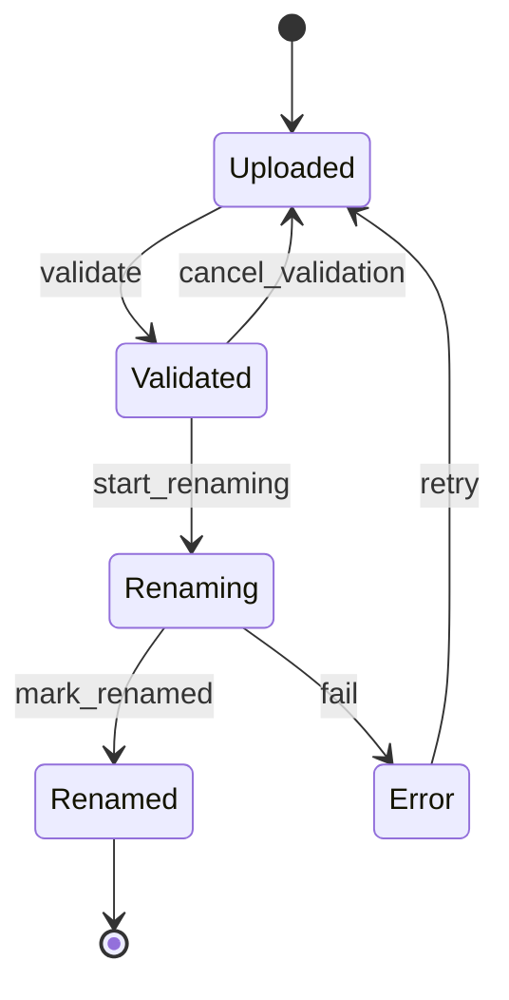

# Workflow de renommage des avatars

## Rôle

Le state machine Symfony `avatar_rename` sécurise le passage d’une image
temporaire vers une ressource avatar définitive. Il est porté par
`App\Entity\AvatarTemp` via sa propriété texte `status`.

Le workflow ne réalise pas lui-même le déplacement du fichier. Il encadre la
validation utilisateur, l’exécution asynchrone, la vérification du résultat et
la reprise après erreur.

> **Blocage connu dans l’état actuel du dépôt**
>
> `config/packages/workflow.yaml` configure le marking store de
> `avatar_rename` sur la propriété `publicationStatus`, alors que
> `src/Entity/AvatarTemp.php` expose `getStatus()` et `setStatus()`. Toute lecture
> du workflow échoue donc avec une `LogicException` demandant
> `getPublicationStatus()`. La propriété attendue dans la configuration est
> `status`. Cette documentation décrit le cycle métier prévu, mais celui-ci ne
> peut pas fonctionner avant correction de ce mapping.

## Schéma état-transition

## Description naturelle des étapes

### Téléversé (`uploaded`)

Le fichier existe dans l’espace temporaire. L’utilisateur choisit son nom final,
sa catégorie et les filtres métier nécessaires. Le fichier peut être supprimé,
ou soumis à la transition `validate`.

La validation résout d’abord le chemin de destination. Si un fichier porte déjà
ce nom, l’utilisateur doit explicitement autoriser son remplacement. Une
validation réussie ne déplace encore aucun fichier.

Fichiers principaux :

- `src/Entity/AvatarTemp.php` ;
- `src/Controller/Avatar/RenameAvatarController.php` ;
- `src/Application/Avatar/Workflow/Guard/AvatarTargetAvailabilityGuard.php` ;
- `src/Application/Avatar/Workflow/Guard/AvatarOverwriteAuthorizationGuard.php`.

### Validé (`validated`)

La destination et les paramètres ont été acceptés. L’utilisateur peut revenir à
l’état téléversé avec `cancel_validation`, ou confirmer le traitement. La
confirmation applique `start_renaming` puis publie un `RenameAvatarMessage` sur
la file Messenger dédiée `avatar_rename`.

Fichiers principaux :

- `src/Controller/Avatar/RenameAvatarController.php` ;
- `src/Message/Avatar/RenameAvatarMessage.php` ;
- `config/packages/messenger.yaml`.

### Renommage en cours (`renaming`)

Le worker charge l’image temporaire, vérifie le nom et les filtres, résout la
destination, déplace ou remplace le fichier, puis crée ou actualise l’entité
avatar correspondante. Une opération partiellement réussie peut être reprise si
le fichier final existe déjà alors que l’enregistrement temporaire est encore
présent.

Avant `mark_renamed`, une garde vérifie le fichier final, son nom, son checksum et
la référence enregistrée dans l’entité avatar. La transition n’est appliquée que
si ces quatre contrôles réussissent.

Fichiers principaux :

- `src/MessageHandler/Avatar/RenameAvatarMessageHandler.php` ;
- `src/Application/Avatar/Services/AvatarRenameService.php` ;
- `src/Application/Avatar/Workflow/Guard/AvatarRenameCompletedGuard.php`.

### Renommé (`renamed`)

Le résultat a été contrôlé. Cet état terminal autorise la suppression de
`AvatarTemp`. Si le même message est reçu une seconde fois, le service ne refait
pas le travail.

Fichier principal :
`src/Application/Avatar/Services/AvatarRenameService.php`.

### Erreur (`error`)

Messenger tente d’abord ses retries configurés. Lorsque le dernier essai échoue,
`AvatarRenameFailureSubscriber` applique `fail` si l’élément est toujours en
`renaming`. L’utilisateur peut ensuite demander `retry`, ce qui remet l’élément
en `uploaded` pour une nouvelle validation.

Fichiers principaux :

- `src/Application/Avatar/Workflow/AvatarRenameFailureSubscriber.php` ;
- `src/Controller/Avatar/RenameAvatarController.php` ;
- `config/packages/messenger.yaml`.

## Transitions

| Transition | Départ | Arrivée | Description |
|---|---|---|---|
| `validate` | Téléversé | Validé | Vérifie le contexte, la destination et l’autorisation de remplacement. |
| `cancel_validation` | Validé | Téléversé | Abandonne la validation avant le lancement du worker. |
| `start_renaming` | Validé | Renommage | Verrouille le travail dans l’état asynchrone avant l’envoi du message. |
| `mark_renamed` | Renommage | Renommé | Certifie que le fichier et l’entité finale sont cohérents. |
| `fail` | Renommage | Erreur | Enregistre l’échec définitif après épuisement des retries Messenger. |
| `retry` | Erreur | Téléversé | Rend l’élément à nouveau modifiable et validable. |

## Gardes et codes de blocage

| Code | Transition | Cause |
|---|---|---|
| `INVALID_RENAME_CONTEXT` | `validate` | Contexte absent ou destination impossible à résoudre. |
| `TARGET_ALREADY_EXISTS` | `validate` | Un fichier cible existe sans autorisation explicite de remplacement. |
| `INVALID_RENAME_RESULT` | `mark_renamed` | Fichier absent, mauvais nom, checksum incorrect ou entité ne référençant pas le résultat. |

Les gardes utilisent `AvatarRenameGuardContextStore` pour transmettre des objets
de contexte aux événements Symfony Workflow sans persister de données de
contrôle temporaires dans l’entité.

## Erreurs de traitement

Le service refuse notamment :

- un nom qui ne respecte pas le format sûr `A-Za-z0-9_- + .png` ;
- un nom contenant un séparateur de chemin ou `..` ;
- l’absence d’un filtre obligatoire ;
- une destination hors des répertoires autorisés ;
- l’impossibilité de créer le dossier final ;
- l’échec du checksum, du remplacement ou du déplacement du fichier ;
- un message reçu alors que l’entité n’est pas en `renaming`.

Les exceptions déclenchent les retries Messenger. Seul l’échec définitif fait
passer l’état à `error`.

## Fichiers concernés

| Fichier | Responsabilité |
|---|---|
| `config/packages/workflow.yaml` | États et transitions ; contient actuellement le mauvais nom de propriété du marking store. |
| `src/Entity/AvatarTemp.php` | État et métadonnées temporaires. |
| `src/Application/Avatar/Workflow/AvatarRenameWorkflow.php` | Constantes des places et transitions. |
| `src/Application/Avatar/Workflow/Guard/AvatarTargetAvailabilityGuard.php` | Résolution et contrôle de la cible. |
| `src/Application/Avatar/Workflow/Guard/AvatarOverwriteAuthorizationGuard.php` | Autorisation de remplacement. |
| `src/Application/Avatar/Workflow/Guard/AvatarRenameCompletedGuard.php` | Validation du résultat final. |
| `src/Application/Avatar/Workflow/AvatarRenameFailureSubscriber.php` | Passage en erreur après le dernier échec. |
| `src/Application/Avatar/Services/AvatarRenameService.php` | Traitement métier et effets sur le système de fichiers. |
| `src/Controller/Avatar/RenameAvatarController.php` | Actions utilisateur, CSRF et envoi du message. |
| `src/Message/Avatar/RenameAvatarMessage.php` | Charge utile asynchrone. |
| `src/MessageHandler/Avatar/RenameAvatarMessageHandler.php` | Point d’entrée du worker. |
| `tests/Avatar/Unit/Workflow/AvatarRenameWorkflowTest.php` | Test isolé de toutes les transitions et du retour après erreur. |
| `tests/Avatar/Integration/Workflow/AvatarRenameValidationWorkflowTest.php` | Test du workflow Symfony réel et des gardes de validation. |
| `tests/Avatar/Integration/AvatarRenameProcessTest.php` | Test de Doctrine, Messenger, du handler et du déplacement du fichier. |
| `tests/Avatar/Application/AvatarCatalogueTest.php` | Test HTTP/DOM du catalogue et de ses actions d’administration. |

Voir aussi [le worker de renommage](../workers/avatar-rename.md).
