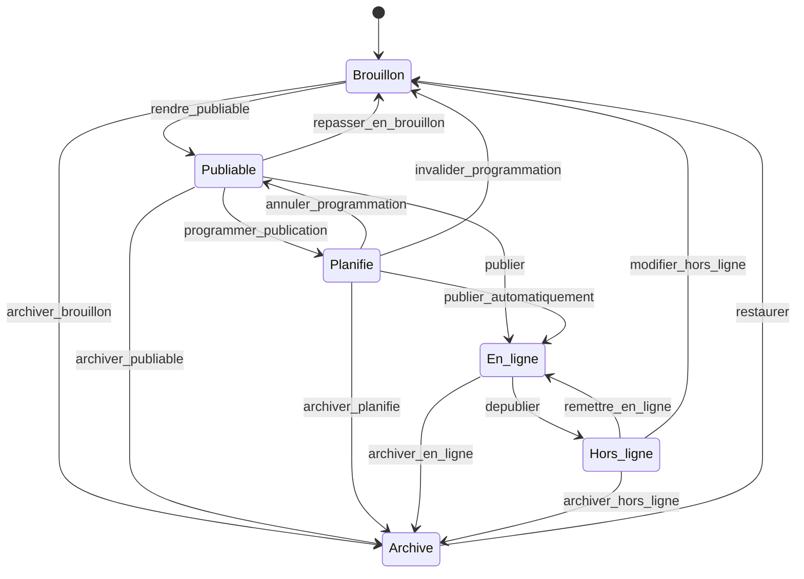
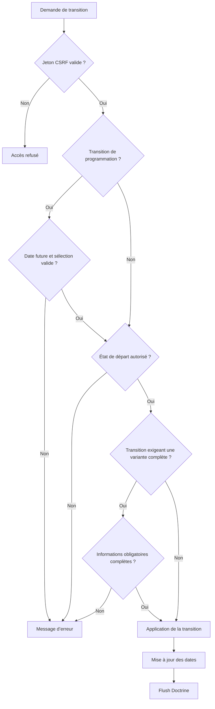
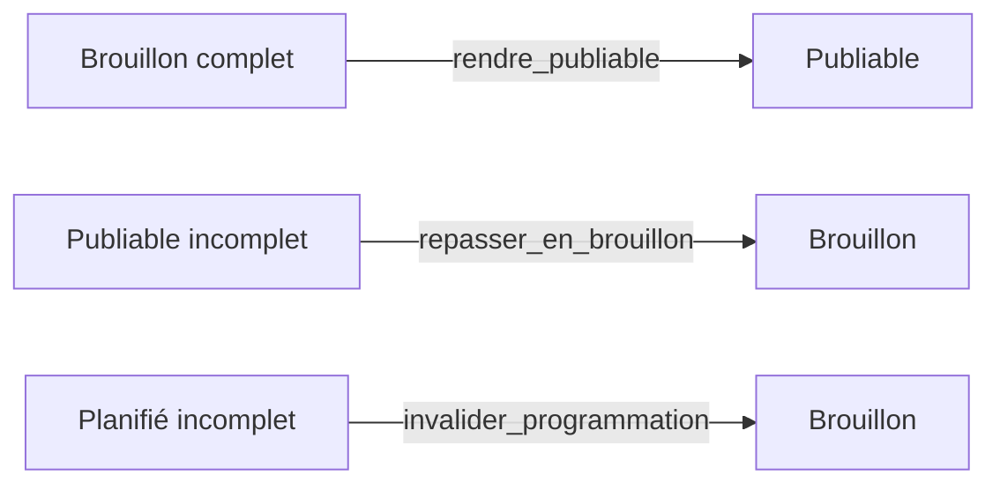

# Workflow de publication des vêtements

## Vue d’ensemble

Le workflow Symfony `clothe_publication` pilote la publication de chaque
`ClothesVariant`. Le statut n’est pas porté par l’entité `Clothes` : deux tailles
ou deux couleurs d’un même vêtement peuvent donc se trouver dans des états
différents.

La propriété persistée est `ClothesVariant::$publicationStatus`, typée avec
l’enum `ClotheStatus`. Une nouvelle variante commence toujours en `Brouillon`.
Les dates techniques associées sont :

- `scheduledPublicationAt` : date prévue pour une publication automatique ;
- `publishedAt` : date de la dernière mise en ligne ;
- `archivedAt` : date de l’archivage logique.

L’archivage constitue le soft delete normal d’une variante. Le stock ne bloque
jamais une transition de publication.

## Schéma état-transition



## Description naturelle des états

### Brouillon (`draft`)

La variante est en cours de préparation. Elle peut être enregistrée même si des
informations obligatoires manquent. Elle n’est ni publiable ni visible dans la
boutique. Dès que toutes ses informations obligatoires sont présentes, la
réconciliation peut appliquer `rendre_publiable`. Un brouillon abandonné peut
être archivé.

Fichiers concernés :

- `src/Enum/ClotheStatus.php` pour la valeur et son libellé ;
- `src/Entity/Clothes/ClothesVariant.php` pour la valeur initiale ;
- `src/Application/Clothes/Services/ClotheCompletenessChecker.php` pour décider
  si la variante peut quitter le brouillon ;
- `src/Application/Clothes/Services/ClotheWorkflowService.php` pour la
  réconciliation et l’application des transitions ;
- `config/packages/workflow.yaml` pour les sorties autorisées.

### Publiable (`publishable`)

La variante possède toutes les informations nécessaires. Elle n’est pas encore
visible, mais l’utilisateur peut la publier immédiatement ou la sélectionner
dans la modal de programmation. Si une information obligatoire disparaît, la
réconciliation la replace en brouillon.

Fichiers concernés :

- `src/Application/Clothes/Services/ClotheCompletenessChecker.php` pour les
  critères de complétude ;
- `templates/clothes/show.html.twig` pour les actions disponibles par variante ;
- `templates/clothes/_schedule_modal.html.twig` pour la sélection des variantes
  à programmer ;
- `src/Controller/Clothes/ClotheController.php` pour la publication manuelle et
  la programmation groupée.

### Planifié (`scheduled`)

La variante est publiable et possède une date future dans
`scheduledPublicationAt`. Tant que cette date n’est pas atteinte, l’utilisateur
peut annuler la programmation, invalider la variante vers le brouillon ou
l’archiver. À l’échéance, le scheduler vérifie une dernière fois la complétude :
la variante complète passe en ligne ; la variante devenue incomplète revient en
brouillon.

Fichiers concernés :

- `src/Entity/Clothes/ClothesVariant.php` pour `scheduledPublicationAt` ;
- `src/Scheduler/Task/PublishScheduledClothes/PublishScheduledClothesScheduleProvider.php`
  pour l’exécution toutes les minutes ;
- `src/Scheduler/Task/PublishScheduledClothes/PublishScheduledClothesMessage.php`
  pour le message périodique ;
- `src/Scheduler/Task/PublishScheduledClothes/PublishScheduledClothesHandler.php`
  pour la décision publication/invalidation ;
- `src/Repository/Clothes/ClothesVariantRepository.php` pour rechercher les
  échéances atteintes ;
- `src/Command/PublishScheduledClothesCommand.php` pour l’exécution manuelle.

### En ligne (`online`)

La variante est publiée. `publishedAt` est renseigné et toute ancienne date de
programmation est supprimée. Elle peut être dépubliée temporairement ou archivée.

Être `En ligne` ne suffit pas, à lui seul, pour apparaître dans la boutique : la
catégorie et la collection doivent également avoir `isOnline = true`. Ces deux
booléens restent indépendants du workflow des variantes.

Fichiers concernés :

- `src/Application/Clothes/Services/ClotheWorkflowService.php` pour la mise à
  jour de `publishedAt` ;
- `src/Repository/Clothes/ClothesVariantRepository.php` pour les requêtes de la
  boutique, qui imposent le statut `online` ainsi qu’une catégorie et une
  collection en ligne.

### Hors ligne (`offline`)

La variante a déjà été publiée, mais elle est temporairement retirée de la
boutique. Elle peut être remise en ligne directement si elle reste complète. Si
des changements importants sont nécessaires, `modifier_hors_ligne` la replace
en brouillon. Elle peut aussi être archivée définitivement.

Fichiers concernés :

- `config/packages/workflow.yaml` pour les trois sorties possibles ;
- `src/Application/Clothes/Services/ClotheWorkflowService.php` pour le contrôle
  de complétude avant `remettre_en_ligne` ;
- `templates/clothes/show.html.twig` pour les actions proposées.

### Archivé (`archived`)

La variante est retirée logiquement du cycle normal de publication. Aucune
suppression physique n’est effectuée. `archivedAt` mémorise la date de
l’archivage et la date de programmation est effacée. Une restauration replace
toujours la variante en brouillon afin qu’elle soit vérifiée avant une nouvelle
publication.

Fichiers concernés :

- `src/Application/Clothes/Services/ClotheWorkflowService.php` pour renseigner ou
  effacer `archivedAt` ;
- `config/packages/workflow.yaml` pour les transitions d’archivage et
  `restaurer` ;
- `src/Entity/Clothes/ClothesVariant.php` pour la persistance de `archivedAt`.

## Description des transitions

| Transition | Départ | Arrivée | Sens métier et effets |
|---|---|---|---|
| `rendre_publiable` | Brouillon | Publiable | Confirme que la variante est complète. Cette transition est bloquée si une information obligatoire manque. |
| `repasser_en_brouillon` | Publiable | Brouillon | Retire le caractère publiable lorsqu’une donnée obligatoire manque ou doit être retravaillée. |
| `programmer_publication` | Publiable | Planifié | Enregistre une date future. Depuis l’interface, plusieurs variantes publiables peuvent être sélectionnées et programmées ensemble. |
| `annuler_programmation` | Planifié | Publiable | Annule la programmation sans invalider la variante et efface `scheduledPublicationAt`. |
| `invalider_programmation` | Planifié | Brouillon | Annule la programmation parce que la variante est devenue incomplète et efface `scheduledPublicationAt`. |
| `publier` | Publiable | En ligne | Publie immédiatement, renseigne `publishedAt` et efface une éventuelle date programmée. |
| `publier_automatiquement` | Planifié | En ligne | Est appliquée par le scheduler lorsque l’échéance est atteinte et que la variante est encore complète. |
| `depublier` | En ligne | Hors ligne | Retire temporairement la variante de la boutique. |
| `remettre_en_ligne` | Hors ligne | En ligne | Republie la variante après un nouveau contrôle de complétude et actualise `publishedAt`. |
| `modifier_hors_ligne` | Hors ligne | Brouillon | Replace la variante dans un état de travail avant des modifications importantes. |
| `archiver_brouillon` | Brouillon | Archivé | Abandonne logiquement un brouillon. |
| `archiver_publiable` | Publiable | Archivé | Retire une variante complète qui ne doit finalement pas être publiée. |
| `archiver_planifie` | Planifié | Archivé | Annule définitivement une publication programmée et efface sa date. |
| `archiver_en_ligne` | En ligne | Archivé | Retire définitivement la variante publiée du catalogue. |
| `archiver_hors_ligne` | Hors ligne | Archivé | Retire définitivement une variante déjà hors ligne. |
| `restaurer` | Archivé | Brouillon | Efface `archivedAt` et force une nouvelle vérification avant publication. |

La liste structurelle des places et transitions se trouve dans
`config/packages/workflow.yaml`. Les effets de bord sur les dates et les
validations métier se trouvent dans
`src/Application/Clothes/Services/ClotheWorkflowService.php`.

## Gardes, blocages et critères de complétude

Les blocages ne sont pas déclarés sous forme de `guard` dans
`workflow.yaml`. Ils sont appliqués dans le service métier avant l’appel à
`WorkflowInterface::apply()`.

Une variante est complète uniquement si :

- le vêtement parent possède un nom non vide ;
- son prix est strictement supérieur à zéro ;
- une collection est définie ;
- la variante possède une couleur ;
- la variante possède une taille ;
- la variante possède au moins une image.

Le stock, la description, la méta-description, l’image bestseller et l’image de
mise en avant ne font pas partie de ces critères.

Les transitions `rendre_publiable`, `publier`, `publier_automatiquement` et
`remettre_en_ligne` relancent le contrôle de complétude. Toute transition est
également bloquée si son état de départ ne correspond pas à l’état courant ; ce
contrôle est réalisé avec `WorkflowInterface::can()`.

La programmation ajoute les règles suivantes :

- la date doit être strictement future ;
- au moins une variante doit être sélectionnée ;
- chaque identifiant sélectionné doit appartenir au vêtement affiché ;
- chaque variante sélectionnée doit encore être `Publiable` au moment du POST ;
- l’opération groupée valide toute la sélection avant d’appliquer la première
  transition, afin d’éviter une programmation partielle en cas de sélection
  invalide.

Le bouton `Programmer` est affiché dès qu’au moins une variante du groupe est
`Publiable`. La modal ne présente que les variantes publiables.

## Schéma des contrôles avant transition



## Erreurs métier possibles

Les erreurs de complétude proviennent de
`ClotheCompletenessChecker::checkVariant()` :

- `Le nom du vêtement est obligatoire.`
- `Le prix doit être supérieur à zéro.`
- `La collection est obligatoire.`
- `La couleur est obligatoire.`
- `La taille est obligatoire.`
- `Ajoutez au moins une image.`

Les erreurs de transition et de programmation proviennent principalement de
`ClotheWorkflowService` et `ClotheController` :

- date absente ou non future ;
- aucune variante sélectionnée ;
- variante sélectionnée étrangère au vêtement ou non publiable ;
- aucune variante à programmer ;
- transition impossible depuis l’état courant ;
- variante refusée par le state machine ;
- jeton CSRF invalide ;
- vêtement introuvable.

Dans les actions classiques, les `DomainException` sont converties en messages
flash et l’utilisateur revient sur `clothes_show`. Les erreurs CSRF provoquent un
refus d’accès. Les formulaires utilisent Turbo, mais les mêmes contrôles sont
toujours exécutés côté serveur.

## Réconciliation automatique de la complétude

`ClotheWorkflowService::reconcileVariant()` ne modifie que trois états :



Les états `En ligne`, `Hors ligne` et `Archivé` ne sont pas automatiquement
modifiés par cette réconciliation.

La commande de contrôle global est :

```bash
php bin/console app:clothes:reconcile-publication-status
```

Elle charge toutes les variantes, affiche chaque changement et termine par le
nombre de variantes vérifiées et mises à jour. Son implémentation se trouve dans
`src/Command/ReconcileClothesVariantPublicationStatusCommand.php`.

## Publication automatique

Le schedule `clothes_publication` émet un message toutes les minutes. Pour le
faire tourner en continu, le transport Scheduler correspondant doit être
consommé :

```bash
APP_ENV=prod APP_DEBUG=0 php bin/console messenger:consume scheduler_clothes_publication
```

À chaque passage :

1. le repository sélectionne les variantes `Planifié` dont
   `scheduledPublicationAt <= maintenant` ;
2. le handler vérifie à nouveau leur complétude ;
3. une variante complète reçoit `publier_automatiquement` ;
4. une variante incomplète reçoit `invalider_programmation` et retourne en
   brouillon.

La même opération peut être déclenchée ponctuellement sans worker :

```bash
php bin/console app:clothes:publish-scheduled
```

## Interface d’administration

Dans `clothes_show`, l’onglet Publication est rendu par
`templates/clothes/show.html.twig`. Il affiche un tableau
`Vêtement / Statut / Actions`, une ligne par variante, et ne propose que les
transitions actuellement activées par Symfony Workflow. La programmation n’est
pas affichée dans chaque ligne : elle passe par le bouton global et la modal
`templates/clothes/_schedule_modal.html.twig`.

Les routes concernées sont définies dans
`src/Controller/Clothes/ClotheController.php` :

- `app_clothes_workflow_transition` applique une transition individuelle ;
- `app_clothes_schedule_modal` charge la modal Turbo ;
- `app_clothes_schedule` valide la sélection et programme les variantes.

Dans `clothes_index`, un vêtement affiche le statut le plus avancé parmi les
variantes de son groupe. L’ordre est défini par
`ClotheStatus::progressionRank()` : Brouillon, Publiable, Planifié, En ligne,
Hors ligne, Archivé. Le filtre de statut du repository utilise le même calcul.

## Persistance et migrations

Les colonnes du workflow sont déclarées dans
`src/Entity/Clothes/ClothesVariant.php`. L’index Doctrine
`IDX_CLOTHES_VARIANT_PUBLICATION_STATUS` accélère les recherches par statut,
notamment la récupération des publications programmées.

Les migrations concernées sont :

- `migrations/Version20260805142722.php`, qui ajoute les colonnes, convertit
  l’ancien `is_online` des variantes vers `online` ou `draft`, supprime les
  anciens booléens et crée l’index ;
- `migrations/Version20260805143524.php`, qui réaffirme le type, la longueur et
  la valeur par défaut de `publication_status`.

Une valeur vide dans `publication_status` ne peut pas être hydratée par l’enum
PHP. La seconde migration ne contient pas de requête `UPDATE` réparant les
valeurs déjà invalides. Si une base contient encore `''` ou une valeur inconnue,
ces lignes doivent donc être normalisées vers une valeur valide, généralement
`draft`, avant leur chargement par Doctrine.

## Carte des fichiers

| Fichier | Responsabilité |
|---|---|
| `config/packages/workflow.yaml` | Déclare le state machine, ses états et ses transitions. |
| `src/Enum/ClotheStatus.php` | Définit les valeurs, libellés et rangs utilisés par l’index. |
| `src/Entity/Clothes/ClothesVariant.php` | Stocke le statut et les dates du cycle de publication. |
| `src/Application/Clothes/Services/ClotheCompletenessChecker.php` | Produit les erreurs de complétude d’une variante ou d’un vêtement. |
| `src/Application/Clothes/Services/ClotheWorkflowService.php` | Valide et applique les transitions, leurs dates et la programmation groupée. |
| `src/Controller/Clothes/ClotheController.php` | Expose les routes d’administration, CSRF, modal et messages flash. |
| `templates/clothes/show.html.twig` | Affiche le tableau de publication et les actions individuelles. |
| `templates/clothes/_schedule_modal.html.twig` | Permet de choisir les variantes publiables et la date. |
| `src/Repository/Clothes/ClothesVariantRepository.php` | Charge les variantes en ligne, les échéances et les groupes filtrés par statut. |
| `src/Command/ReconcileClothesVariantPublicationStatusCommand.php` | Réconcilie manuellement tous les statuts avec la complétude. |
| `src/Command/PublishScheduledClothesCommand.php` | Exécute manuellement les publications arrivées à échéance. |
| `src/Scheduler/Task/PublishScheduledClothes/PublishScheduledClothesScheduleProvider.php` | Programme un contrôle toutes les minutes. |
| `src/Scheduler/Task/PublishScheduledClothes/PublishScheduledClothesMessage.php` | Représente le tick du scheduler. |
| `src/Scheduler/Task/PublishScheduledClothes/PublishScheduledClothesHandler.php` | Publie ou invalide les variantes arrivées à échéance. |
| `migrations/Version20260805142722.php` | Introduit la structure initiale du statut de publication. |
| `migrations/Version20260805143524.php` | Réaffirme le schéma SQL de la colonne, mais ne corrige pas les lignes déjà invalides. |
| `tests/Application/Clothes/Workflow/ClothePublicationWorkflowTest.php` | Vérifie les transitions configurées et l’ordre des états. |
| `tests/Integration/Clothes/ClotheWorkflowServiceTest.php` | Démarre le kernel, récupère le vrai service et vérifie la programmation avec Doctrine sur la base de test. |

## Vérifications utiles

Le test d’intégration nécessite une base dédiée configurée avec
`TEST_DATABASE_URL` :

```bash
php bin/console --env=test doctrine:database:create --if-not-exists
php bin/console --env=test doctrine:migrations:migrate --no-interaction
```

Il démarre le kernel, récupère le vrai `ClotheWorkflowService` dans le conteneur,
persiste les entités avec Doctrine, vide l’EntityManager puis recharge les
variantes avant les assertions. Une transaction est annulée après chaque test.

```bash
php bin/console lint:container
php bin/console lint:twig templates/clothes/show.html.twig templates/clothes/_schedule_modal.html.twig
php bin/phpunit tests/Application/Clothes/Workflow
php bin/phpunit tests/Integration/Clothes/ClotheWorkflowServiceTest.php
```
