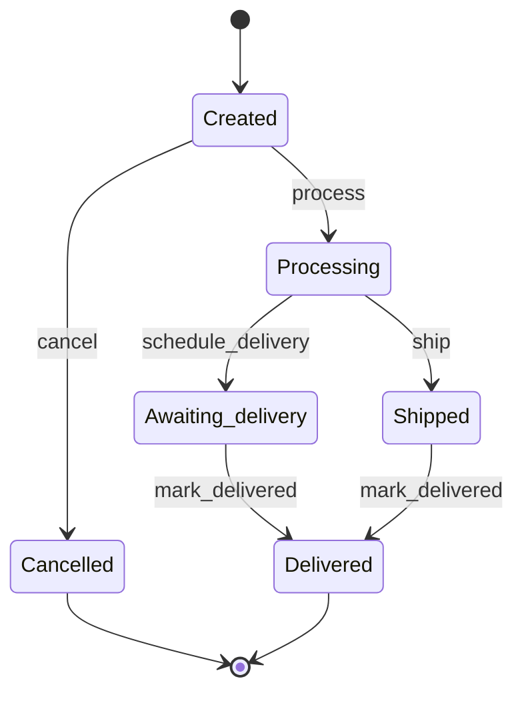

# Workflow des commandes

## Rôle

Le state machine Symfony `order` pilote le cycle de traitement logistique de
`App\Entity\Orders\Orders`. Son état est stocké dans la propriété enum
`orderStatus`. Le statut de paiement (`status`) est distinct : il sert de
condition aux transitions, mais ne remplace pas le statut logistique.

## Schéma état-transition



## Description naturelle des étapes

### Créée (`created`)

La commande existe mais son traitement n’a pas commencé. Une confirmation Stripe
peut appliquer `process` lorsque le paiement et la facture sont présents. Une
commande ne peut être annulée par le workflow que lorsque son paiement est
explicitement expiré.

Fichiers principaux :

- `src/Entity/Orders/Orders.php` ;
- `src/Payment/Stripe/Handler/StripeCheckoutSessionMessageHandler.php` ;
- `src/Application/Orders/Workflow/OrderWorkflowSubscriber.php`.

### En attente de traitement (`processing`)

Le paiement et la facture sont confirmés. Le parcours diverge selon la
destination : une commande destinée à la Guadeloupe doit recevoir une date de
livraison locale ; une commande hors Guadeloupe doit recevoir un numéro de suivi
et être expédiée.

Fichiers principaux :

- `src/Controller/Orders/OrdersController.php` ;
- `src/Application/Orders/Delivery/DeliveryDatePolicy.php` ;
- `src/Application/Orders/Workflow/OrderWorkflowSubscriber.php`.

### Livraison en attente (`awaiting_delivery`)

La livraison locale en Guadeloupe est programmée. La commande conserve sa date
de livraison jusqu’à ce qu’elle soit marquée comme livrée. Cette transition peut
être déclenchée depuis l’administration.

Fichier principal : `src/Controller/Orders/DeliveriesController.php`.

### Expédiée (`shipped`)

La commande hors Guadeloupe a été confiée au transporteur et possède un numéro
de suivi. Elle peut être marquée livrée manuellement ou par le traitement
automatique prévu par l’application.

Fichiers principaux :

- `src/Controller/Orders/OrdersController.php` ;
- `src/Application/Orders/Delivery/AutoDeliverShippedOrderMessageHandler.php` ;
- `src/Application/Orders/Delivery/MarkOrderDeliveredService.php`.

### Livrée (`delivered`)

La livraison est terminée. C’est un état terminal du workflow.

### Annulée (`cancelled`)

Le paiement d’une commande encore créée a expiré. C’est également un état
terminal.

## Transitions et blocages

| Transition | Départ | Arrivée | Conditions |
|---|---|---|---|
| `process` | Créée | Traitement | Paiement confirmé et facture présente. |
| `cancel` | Créée | Annulée | Statut de paiement exactement `payment_expired`. |
| `schedule_delivery` | Traitement | Livraison en attente | Paiement, facture, destination Guadeloupe et date respectant la politique minimale. |
| `ship` | Traitement | Expédiée | Paiement, facture, destination hors Guadeloupe et numéro de suivi. |
| `mark_delivered` | Livraison en attente ou Expédiée | Livrée | Paiement confirmé ; date présente pour une livraison locale ; suivi présent pour une expédition. |

| Code de blocage | Signification |
|---|---|
| `order_payment_not_confirmed` | Le paiement n’est pas confirmé. |
| `order_invoice_missing` | La facture Stripe est absente. |
| `order_payment_not_expired` | L’annulation est demandée avant expiration du paiement. |
| `order_not_shipping_to_guadeloupe` | Une livraison locale est demandée pour une autre destination. |
| `order_delivery_date_missing` | La date de livraison locale est absente. |
| `order_delivery_date_too_soon` | La date ne respecte pas le délai minimal. |
| `order_guadeloupe_requires_local_delivery` | Une expédition transporteur est demandée pour la Guadeloupe. |
| `order_tracking_number_missing` | Le numéro de suivi requis est absent. |

Les blocages sont ajoutés par `OrderWorkflowSubscriber` avec des
`TransitionBlocker`. Les contrôleurs utilisent `buildTransitionBlockerList()`
pour afficher les raisons à l’utilisateur avant d’appliquer la transition.
Chaque transition terminée et chaque garde bloquée sont journalisées avec la
référence et l’identifiant de la commande.

## Fichiers concernés

| Fichier | Responsabilité |
|---|---|
| `config/packages/workflow.yaml` | Structure du state machine. |
| `src/Enum/OrderStatus.php` | Valeurs et libellés des états. |
| `src/Entity/Orders/Orders.php` | Persistance du statut logistique et des données de paiement/livraison. |
| `src/Application/Orders/Workflow/OrderWorkflow.php` | Constantes des transitions. |
| `src/Application/Orders/Workflow/OrderWorkflowSubscriber.php` | Gardes, codes de blocage et audit applicatif. |
| `src/Application/Orders/Delivery/DeliveryDatePolicy.php` | Calcul de la première date locale autorisée. |
| `src/Controller/Orders/OrdersController.php` | Programmation de livraison et expédition. |
| `src/Controller/Orders/DeliveriesController.php` | Validation manuelle de la livraison. |
| `src/Payment/Stripe/Handler/StripeCheckoutSessionMessageHandler.php` | Passage de `created` à `processing` après paiement. |
| `src/Application/Orders/Delivery/MarkOrderDeliveredService.php` | Application centralisée de `mark_delivered`. |
| `src/Application/Orders/Delivery/AutoDeliverShippedOrderMessageHandler.php` | Livraison automatique des commandes expédiées. |
| `tests/Application/Orders/Workflow/OrderWorkflowTest.php` | Couverture des transitions et blocages. |

## Vérification

```bash
php bin/phpunit tests/Application/Orders/Workflow/OrderWorkflowTest.php
```
